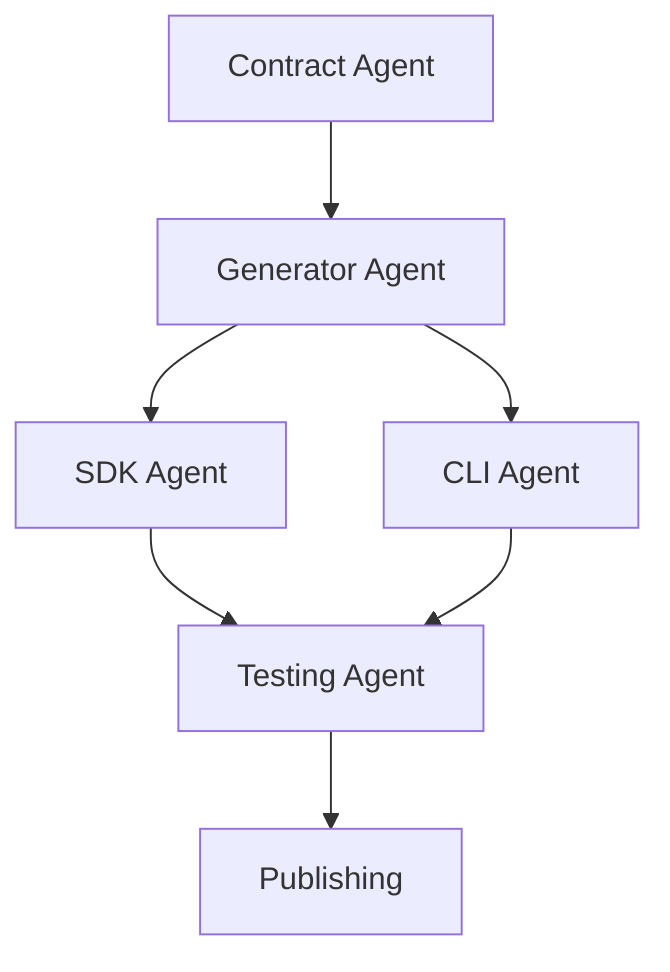

# GateKit Development Workflow

## 🏗️ **Multi-Agent Development System**

This document outlines how multiple AI agents and developers can collaborate on the GateKit contract-driven architecture without conflicts.

## **📂 Source Organization**

### **Single Repository Structure**
```
gatekit/dev/backend/                    # 🎯 SINGLE SOURCE OF TRUTH
├── src/                               # Backend implementation
│   ├── controllers/                   # API endpoints + @CliContract decorators
│   ├── dto/                          # Type definitions (shared across SDK/CLI)
│   ├── services/                     # Business logic (backend-only)
│   └── decorators/                   # @CliContract, @SdkMethod decorators
├── tools/                            # Generation pipeline
│   ├── extractors/                   # Contract extraction from controllers
│   ├── generators/                   # SDK/CLI code generation
│   └── builders/                     # Package compilation & publishing
├── generated/                        # Build outputs (git-ignored)
│   ├── contracts/                    # Extracted contract definitions
│   ├── sdk/                         # @gatekit/sdk package
│   ├── cli/                         # @gatekit/cli package
│   └── docs/                        # Auto-generated documentation
└── docs/                            # Specifications (this file!)
    ├── SDK_SPECIFICATION.md
    ├── CLI_SPECIFICATION.md
    ├── PERMISSION_AWARE_CLI.md
    └── DEVELOPMENT_PRIORITIZATION.md
```

## **🤖 Agent Collaboration Strategy**

### **Agent Roles & Responsibilities**

#### **1. Contract Agent** - Metadata & Decorators
**Focus**: Enhance controllers with rich contract metadata
```typescript
// Task: Add @CliContract decorators to existing endpoints
@Post('/projects')
@RequireScopes('projects:write')
@CliContract({
  command: 'projects create',
  description: 'Create a new project',
  category: 'Projects',
  requiredScopes: ['projects:write'],
  options: {
    name: { required: true, description: 'Project name' },
    environment: {
      choices: ['development', 'staging', 'production'],
      default: 'development'
    }
  }
})
```

#### **2. Generator Agent** - Code Generation Pipeline
**Focus**: Build extraction and generation tools
```typescript
// Task: Implement contract extractor
export async function extractContracts(): Promise<Contract[]> {
  // Parse TypeScript AST
  // Extract @CliContract metadata
  // Generate contract definitions
}
```

#### **3. SDK Agent** - Pure API Client
**Focus**: Generate clean, type-safe SDK
```typescript
// Task: Create SDK from contracts
export class GateKit {
  readonly projects = {
    create: (data: CreateProjectData) => Promise<Project>
  };
}
```

#### **4. CLI Agent** - User Experience & Commands
**Focus**: Generate permission-aware CLI
```typescript
// Task: Build dynamic CLI with permission checking
async function buildCLI(permissions: PermissionResponse): Promise<Command[]>
```

#### **5. Testing Agent** - Quality Assurance
**Focus**: Generate comprehensive tests
```typescript
// Task: Auto-generate tests from contracts
test('projects.create SDK method', async () => {
  // Generated from contract metadata
});
```

## **🔄 Development Workflow**

### **Phase 1: Foundation Sprint (Agent Collaboration)**

#### **Day 1: Contract System**
```bash
# Agent 1: Contract Agent
# Task: Add permission discovery endpoint
# File: src/auth/auth.controller.ts
# Output: /auth/whoami endpoint

# Agent 2: Generator Agent
# Task: Build contract extractor
# File: tools/extractors/contract-extractor.ts
# Output: Extract @CliContract from controllers
```

#### **Day 2: SDK Foundation**
```bash
# Agent 3: SDK Agent
# Task: Generate basic SDK structure
# File: tools/generators/sdk-generator.ts
# Output: Clean API client code

# Agent 5: Testing Agent
# Task: SDK test framework
# File: tools/generators/test-generator.ts
# Output: Auto-generated SDK tests
```

#### **Day 3: CLI Foundation**
```bash
# Agent 4: CLI Agent
# Task: Generate basic CLI commands
# File: tools/generators/cli-generator.ts
# Output: Command registration system

# Agent 1: Contract Agent
# Task: Add more @CliContract decorators
# Files: src/**/*.controller.ts
# Output: Rich metadata for generation
```

### **Phase 2: Permission Intelligence (Advanced Features)**

#### **Week 2: Smart CLI**
```bash
# Agent 4: CLI Agent
# Task: Permission-aware command building
# Achievement: CLI adapts to user permissions

# Agent 1: Contract Agent
# Task: Add permission metadata to all endpoints
# Achievement: Complete permission mapping

# Agent 5: Testing Agent
# Task: Permission-based test scenarios
# Achievement: Test all permission combinations
```

## **⚡ Build System Operations**

### **Daily Development Cycle**
```bash
# 1. Enhance controllers (Contract Agent)
git add src/projects/projects.controller.ts

# 2. Regenerate all packages
npm run generate:all

# 3. Test generated packages
npm run test:sdk
npm run test:cli

# 4. Publish if tests pass
npm run publish:sdk
npm run publish:cli
```

### **Build Commands**
```bash
# Core generation
npm run extract:contracts         # Parse controllers → contracts.json
npm run generate:sdk             # Contracts → SDK package
npm run generate:cli             # Contracts → CLI package
npm run generate:tests           # Contracts → test suites
npm run generate:docs            # Contracts → documentation

# Quality gates
npm run test:generated           # Test all generated packages
npm run lint:generated           # Lint generated code
npm run validate:contracts       # Validate contract consistency

# Publishing
npm run build:all               # Generate everything
npm run publish:sdk             # Publish SDK to npm
npm run publish:cli             # Publish CLI to npm
```

## **🔒 Source Protection Strategy**

### **What Gets Published (PUBLIC)**
```
@gatekit/sdk/
├── index.js              # Compiled SDK (no backend source)
├── index.d.ts            # Type definitions only
├── package.json          # Package metadata
└── README.md             # Auto-generated docs

@gatekit/cli/
├── gatekit.js           # Compiled CLI binary
├── package.json         # Package metadata
└── README.md            # Auto-generated docs
```

### **What Stays Private (BACKEND)**
```
gatekit/dev/backend/
├── src/                 # 🔒 NEVER EXPORTED
├── tools/               # 🔒 NEVER EXPORTED
├── generated/           # 🔒 BUILD ARTIFACTS ONLY
└── docs/               # 🔒 INTERNAL SPECS ONLY
```

### **Strategic Export Process**
```typescript
// tools/builders/package-builder.ts
export async function buildSecurePackage(target: 'sdk' | 'cli') {
  // 1. Generate clean code from contracts
  const code = await generateCode(target);

  // 2. Compile to standalone package
  const package = await compilePackage(code);

  // 3. Remove all source references
  const cleanPackage = stripSourceReferences(package);

  // 4. Validate no backend source leaked
  await validateNoSourceLeakage(cleanPackage);

  return cleanPackage;
}
```

## **🎯 Agent Task Assignment System**

### **Contract Enhancement Tasks**
```yaml
# For Contract Agent
- file: src/projects/projects.controller.ts
  task: Add @CliContract to all methods
  scope: projects:*
  priority: P0

- file: src/platforms/platforms.controller.ts
  task: Add permission metadata
  scope: platforms:*
  priority: P1
```

### **Generator Development Tasks**
```yaml
# For Generator Agent
- component: contract-extractor
  input: NestJS controllers
  output: contracts.json
  priority: P0

- component: sdk-generator
  input: contracts.json
  output: clean SDK package
  priority: P1
```

### **Testing Tasks**
```yaml
# For Testing Agent
- scope: SDK unit tests
  source: generated SDK code
  coverage: >90%
  priority: P1

- scope: CLI integration tests
  source: generated CLI commands
  coverage: >85%
  priority: P2
```

## **🔄 Continuous Integration Pipeline**

### **Automated Quality Gates**
```yaml
# .github/workflows/generate-and-test.yml
on: [push, pull_request]

jobs:
  generate:
    - Extract contracts from backend
    - Generate SDK package
    - Generate CLI package
    - Run generated package tests
    - Validate no source leakage
    - Publish if all tests pass

  security:
    - Scan generated packages for backend source
    - Validate permission system integrity
    - Check for credential leakage
```

### **Development Guardrails**
```bash
# Pre-commit hooks
npm run validate:contracts        # Ensure contracts are valid
npm run test:generated           # Test generated code works
npm run check:source-protection  # Verify no backend source in packages
```

## **🎪 Advanced Collaboration Features**

### **Agent Communication System**
```typescript
// Agents can leave structured comments for each other
interface AgentTask {
  assignedTo: 'contract' | 'generator' | 'sdk' | 'cli' | 'testing';
  priority: 'P0' | 'P1' | 'P2' | 'P3' | 'P4';
  description: string;
  files: string[];
  dependencies: string[];
  estimatedHours: number;
  blockers?: string[];
}

// Example agent coordination:
const task: AgentTask = {
  assignedTo: 'cli',
  priority: 'P1',
  description: 'Implement permission-aware help system',
  files: ['tools/generators/cli-generator.ts'],
  dependencies: ['permission-api-complete'],
  estimatedHours: 3,
  blockers: ['waiting-for-contract-metadata']
};
```

### **Cross-Agent Dependencies**


## **🏆 Success Indicators**

### **Per-Agent Success Metrics**
- **Contract Agent**: All endpoints have rich @CliContract metadata
- **Generator Agent**: <30s full regeneration time
- **SDK Agent**: <50KB bundle, zero backend source leakage
- **CLI Agent**: Perfect permission accuracy, smart error messages
- **Testing Agent**: >90% coverage across all generated packages

### **System-Wide Success**
- **Perfect Sync**: Backend change → SDK/CLI updated automatically
- **Zero Leakage**: No backend source in published packages
- **Enterprise Ready**: Permission-aware CLI suitable for team environments
- **Market Leader**: Most sophisticated API tooling in messaging space

---

**This documentation provides a complete blueprint for building the world's most advanced API tooling system!** 🚀

Every agent now has clear responsibilities, the architecture protects source code while enabling powerful features, and the permission-aware CLI will be a massive competitive advantage.